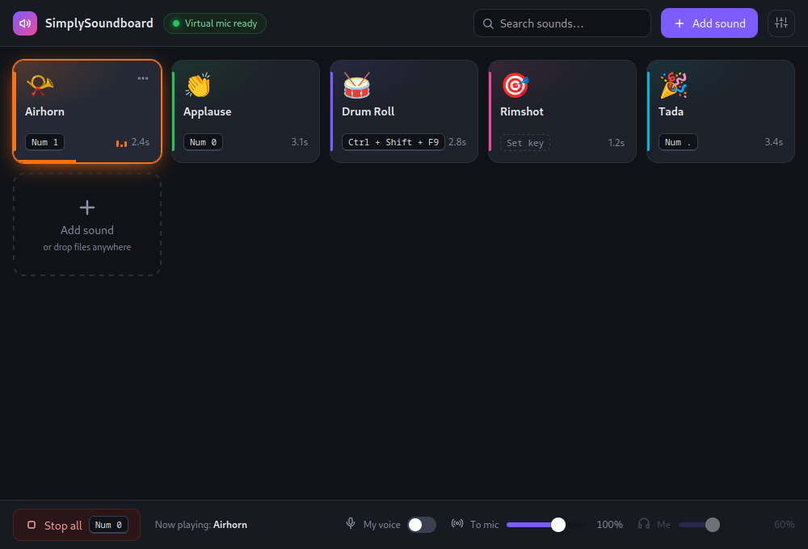
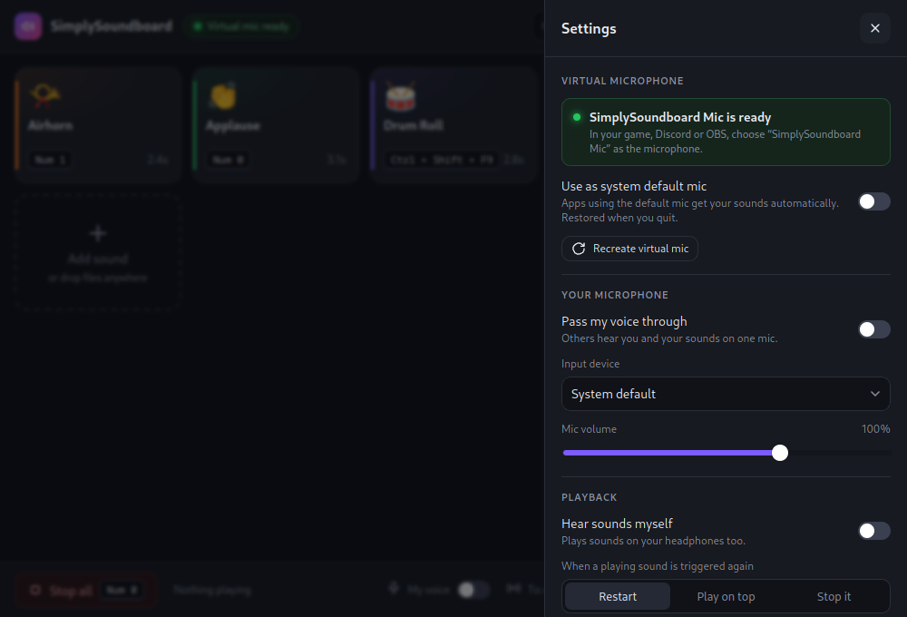

# SimplySoundboard

A small, friendly **Linux-only** soundboard. Sounds live on cards; each card can have a global
hotkey that works **inside games**. Sounds are mixed into a **virtual microphone** so teammates on
Discord / in-game voice hear them.



- Global hotkeys read `/dev/input` directly (read-only, never grabbed) — they work on X11, on every
  Wayland compositor and while a fullscreen game has focus.
- Virtual mic **"SimplySoundboard Mic"** = soundboard sounds + optional pass-through of your real mic.
- Optional monitor so you hear the sounds yourself, and a *Stop all* hotkey.



## What you need

PipeWire with the PulseAudio interface (the default on modern Fedora/Ubuntu/Arch desktops), plus
`pactl` and `pw-play`:

| Distro | Packages |
|---|---|
| Fedora | `pipewire-pulseaudio pulseaudio-utils pipewire-utils` |
| Ubuntu/Debian | `pipewire-pulse pulseaudio-utils pipewire-bin` |
| Arch | `pipewire-pulse libpulse pipewire` |

## Install

1. **Package** from the [Releases page](https://github.com/bekto/SimplySoundboard/releases/latest)
   (recommended — hotkeys work immediately, no extra prompt):
   - Fedora / openSUSE: install the `.rpm`
   - Debian / Ubuntu: install the `.deb`
   - any distro: run the `.AppImage` (then click *Enable hotkeys* once)
2. Start SimplySoundboard from your application menu (or run the AppImage).
3. Add sounds, press **Set key** on a card and choose a key.

Building the packages yourself:

```sh
npm install
npm run tauri build      # writes src-tauri/target/release/bundle/{appimage,deb,rpm}
```

## How to use it in a game

1. Install a package (or run the AppImage and click *Enable hotkeys* once — that installs a udev
   rule through a single password prompt and never prompts again).
2. Add your sounds and give the ones you need a **Set key**. **Numpad keys or F13–F24** are the best
   choice: no game binds them, and the key still reaches the game (SimplySoundboard only listens, it
   never grabs).
3. In the game / Discord / OBS pick **SimplySoundboard Mic** as your microphone — or turn on
   *Use as system default mic* in the settings drawer, which is restored when you quit.
4. Press your keys. The *Stop all* key silences everything at once.

### Troubleshooting

- **Hotkeys do nothing** → open the settings drawer → *Hotkeys*: the status line must say *Enabled*.
  If it does not, click *Enable hotkeys*. If it still fails, log out and back in once.
- **Others cannot hear the sounds** → check that the app/game input device is
  *SimplySoundboard Mic*, that *To mic* is not at 0, and that the virtual mic pill in the title bar
  is not red (then use *Recreate virtual mic*).
- **You hear nothing yourself** → turn on *Hear sounds myself* and raise *Me*.
- **Anti-cheat** → SimplySoundboard only opens keyboard devices for reading; it never injects input
  and never grabs a device, so keys behave exactly as before.

## Development

```sh
sudo dnf install webkit2gtk4.1-devel openssl-devel curl wget file libappindicator-gtk3-devel librsvg2-devel pipewire-utils pulseaudio-utils
sudo dnf group install c-development
```

```sh
sudo apt install libwebkit2gtk-4.1-dev build-essential curl wget file libssl-dev libayatana-appindicator3-dev librsvg2-dev pipewire-bin pulseaudio-utils
```

```sh
sudo pacman -S webkit2gtk-4.1 base-devel curl wget file openssl libappindicator-gtk3 librsvg pipewire libpulse
```

```sh
npm install
npm run tauri dev
```

Checks:

```sh
cd src-tauri && cargo clippy -- -D warnings && cargo test
npm run build
```

Releasing: bump `version` in `package.json`, `src-tauri/tauri.conf.json` and `src-tauri/Cargo.toml`,
commit, then `git tag v0.2.0 && git push origin v0.2.0`. The *Release* workflow builds the
`.AppImage`, `.deb` and `.rpm` on Ubuntu 22.04 and attaches them to a draft release; review it on
GitHub and click *Publish*.

## License

MIT
